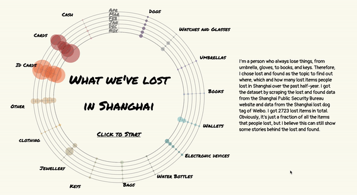

## What We've Lost in Shanghai

#### Description

&emsp;This project shows where, which and how many lost items people lost in Shanghai over the past half-year and some interesting storied behind these lost items.

&emsp;I chose this subject not only because I am a person who always lose things, but also because I found there are some deeper meanings and stories behind the lost and found.

&emsp;I got the dataset by scraping the lost and found data from the Shanghai Public Security Bureau website and data from the Shanghai lost dog tag of Weibo. I got 2723 lost items in total. Obviously, it’s just a fraction of all the items that people lost, but I believe this can still show some stories behind the lost and found.

&emsp;Finally, take care of your belongings =D

  

#### Sources:  
Shanghai Public Security Bureau website: https://gaj.sh.gov.cn/shga/vZswwh/index
 
Shanghai lost dog tag of Weibo:https://weibo.com/p/1008080f1fdfa0eef0ef063b1727574818634a/super_index
