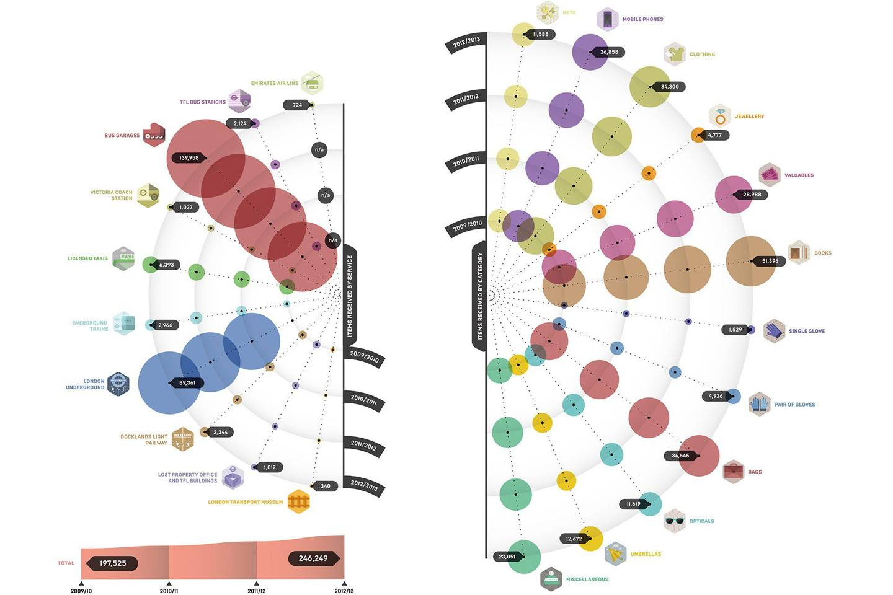
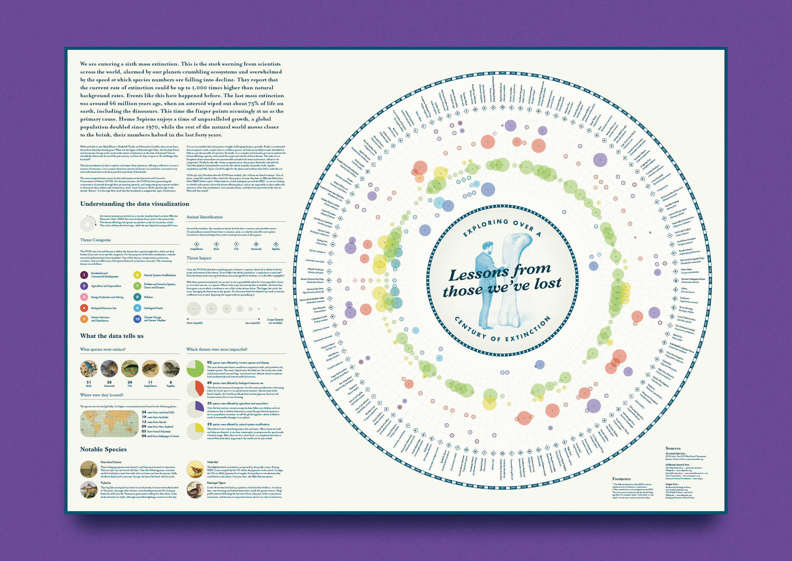

### Data Story Contextual Progress Report
The subject of my project is the things that were lost or stolen in Shanghai in the past half-year. I got the dataset by scraping the lost and found data from the Shanghai Public Security Bureau website. I chose this subject not only because I am a person who always loses things, but also because I found there are deeper meanings behind the lost and found.

There is an idiom in Chinese called 失而复得 (Shi er fu de), which means retrieving what one has previously lost. I’ve always felt that this word is very romantic and contains a series of special feelings. People always cherish and treasure those things more after retrieving them again.
The definition of lost and found is much broader than the physical objects in the lost and found. Time, childhood, or even life, can all be things that people lost. In October 2018, a lost and found pop-up museum was opened in Shanghai. In this exhibition, the installations show the precious things that people may lose because of drunk driving, including hats, business licenses, stethoscopes, visas and other symbols of all the opportunities that can be lost due to drunk driving.

Besides the physical objects in lost and found, I also scraped data from the “Shanghai lost dog” tag of Weibo to also include the lost dogs in my dataset. Definitely, there are also a lot of lost things that are not included in my dataset. According to some pieces of news, Didi received about 1.13 million lost items in 2018. I was surprised by this number since people lost much more items than I thought. However, I found that although people lost that many items, it’s very hard to find the complete dataset. One reason is that according to Chinese "Property law”, lost property that is not claimed by the owner within half a year will belong to the state. Therefore, almost all the lost and found websites only show the lost items within 6 months. After 6 months, even if the owner of lost property comes to claim the item, he or she still can’t retrieve it back. Although that sounds unreasonable, it’s a way to deal with millions of unclaimed lost items.

I found two data visualization artwork also about the things people lost. The first one, called London's Lost Properties, shows both where, which and how many lost items were found in London over the last four years. Each axis of the left semicircle represents the places where the objects were found, and each axis of the right is a specific type of object. The diameter of each bubble represents the number of lost items. This project contains a very comprehensive dataset and the visualization part is also elegant and straightforward.

Another artwork is called Lessons from those we've lost, which explores over a century of extinction, mapping the threats faced by every lost species since 1900. The way to visualize the data is quite similar to the former one.

However, these two data visualizations are not interactive. Therefore, inspired by these two artworks, I would also like to visualize my dataset in a similar way. What is different is that by clicking each little circle, a map with the location where each item was lost would show up. I also would like to show what kind of things that people are more likely to lose and the locations where more things were lost. I will also choose some unique items I found interesting and show them in detail. After browsing through the dataset, I found that mobile phones, wallets, ID cards are the most common things that people lost. However, there are some very interesting things, for example, crayfish, pancakes, baby bottles, or trash cans.

Link to the two data visualizations: [London's Lost Properties](https://www.behance.net/gallery/17832017/WIRED-UK-INFOPORN-Londons-Lost-Property)
[Lessons from those we've lost](https://www.jamesrounddesign.com/lessons-from-those-weve-lost)
