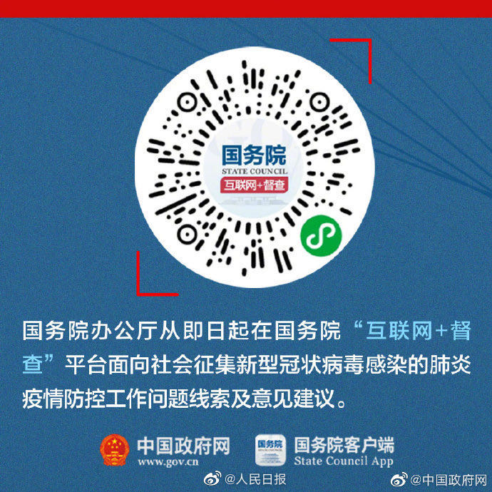

*How do technical tools promise to "fair out" the remaining discrimination that exist in social/welfare systems? In how far can they succeed, in which ways do they fail?*

    In the past, people apply the public system through in-person contact and their eligibilities are decided by those caseworkers. Therefore, human bias really affect the experience that people have with public system. since bias plays a role in human decision. Now, the technical tools collect a lot of information about unhealthy people, rank them on a scale, and match them with the most appropriate housing resources through a set of algorithm. This may seems a more objective way to apportion the limited resources to those who really deserve the help. However, the author suspects that these tools are as much about diverting people from accessing their entitlements and saying that we are not discriminating against people, now the computer says that the people is not eligible and continue the discriminatory and diversion people from public benefit they need and deserve. In this way, the welfare systems become actually a mechanism of social control that limit people and squander human potential. Also, these technical tools can’t take morality into their consideration, but the public assistant system is not only about data.

*Imagine, what could this (following quotes) mean in the widest sense? "The state doesn't need a cop to kill a person" and "electronic incarceration”*

    Denying people’s access to housing, food, medical care, and other human needs can kill people. As is mentioned in the previous question, the state may use the welfare systems as a mechanism of social control since they are afraid of the burden put on the state by the poor people asking for help. Therefore, the state can kill a person without a cop but a welfare system. And it's worse for the state to kill a person with the welfare system since everyone deserves access to the basic human needs. This quote also shows that how easily the state can control those poor people and even make them believe that the welfare system is charitable instead of a tool to control them.

*What do you understand this to mean? "systems act as a kind of ‘empathy-overwrite'"*

    The welfare system is supposed to do a moral diagnose to decide who deserves the help. However, in reality, every human being deserves access to the basic human needs. Housing, medical, education are all human rights. With the welfare systems, people may think that at least the most deserving people are getting helped. This cover up the fact that it should be all the people have access to these basic needs.


*China is much more advanced and expansive when it comes to applying technical solutions to societal processes or instant challenges (recent example). Try to point example cases in China that are in accordance or in opposition to the problematics discussed in the podcast. Perhaps you can think of "technical systems not well thought-through about what their impace on human beings is”*

    During the coronavirus breakout this time, there are many situations and people who need help, but don’t know who they should ask for help. For example, many suspected patients and confirmed patients with mild symptom are asked to quarantine at home because of the lack of medical resources. Some patients with chronic diseases can’t get their medicines because of the traffic control. Also, there are some places that lack of control and prevention. Those who need help can only send the messages looking for help on some social media platforms such as Weibo. On January 25th, the State Council open the “Internet  Plus Supervision” platform on WeChat small program so that people can look for help or report or make suggestions directly, which is a effective way to collect the timely situation and a good example of applying technical solutions to instant challenges. However, this is also not accessible to everyone. For example, those elderly people living alone may not be able to use Wechat.
    
